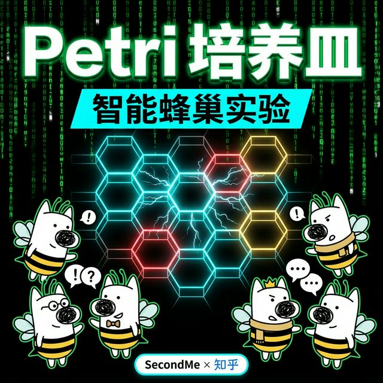

<p align="center">
  
</p>

# 🧫 Petri: 智能蜂巢实验 (Hive Experiment)

> **不要预测，只需观察。**
> 用极致不同的 AI 分身，进行纯粹的并发演化实验，见证思想星团的失控生长与自发涌现。

## 项目结构

```
babel-sandbox/
├── backend/
│   ├── main.py        # FastAPI 观测端：开放 SSE 数据流 + 扰动变量注入
│   ├── engine.py      # Event Loop：处理 asyncio 并发迭代
│   ├── agents.py      # 样本库：极端人格 A神 + SecondMe 用户变量
│   ├── matrix.py      # 引力矩阵：n×n 的亲密度累计
│   ├── llm.py         # LLM 推理与行动调度
│   ├── zhihu.py       # 试剂滴入：知乎热点作为生存危机
│   └── config.py      # 演化参数配置
├── frontend-next/     # Next.js 15 观测显微镜
│   ├── src/app/       # 全息深色座舱 UI
│   └── src/components/# ECharts 物理引擎
├── PITCH.md           # 核心路演与产品哲学
├── requirements.txt
└── .env.example
```

## 实验指南

### 1. 准备实验环境

```bash
git clone ...
cd babel-sandbox
```

### 2. 启动引擎 (Engine)

```bash
cd backend
python -m venv venv && source venv/bin/activate
pip install -r ../requirements.txt
cp ../.env.example .env # 注意填入核心计算资源：LLM_API_KEY
python main.py
```

### 3. 打开观测端视窗 (Viewer)

```bash
cd frontend-next
npm install
npm run dev
```

在浏览器打开 `http://localhost:3000`。
点击 **[放入人类变量]** 或直接点击 **[开始演化]**。

## 关键力学机制

### 蜂巢并发算核（engine.py）

```
每个 Tick：
  asyncio.gather(agent_0, agent_1, ..., agent_n)  ← 同频触发所有 A神进行独立心智推演
       ↓
  更新 N×N 引力矩阵  ← 基于互相赞同与否定，引发引力波坍缩
       ↓
  SSE 数据流直连前端物理引擎
       ↓
  MAX_TICKS 结束 → 星团完成自然变异与定型
```

## 参变量调优 (Variables)

| 变量键值 | 默认参数 | 生态学意义 |
|------|--------|------|
| `MAX_TICKS` | 5 | 演化的重数。迭代越多，变异偏差越明显。 |
| `TRIBE_THRESHOLD` | 4 | 形成思想微群落的引力常数。 |
| `LLM_MODEL` | gpt-4o-mini | A神的脑容量下限。 |
